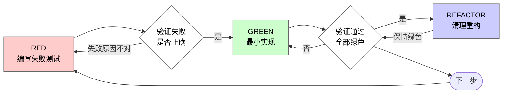

# 测试驱动开发（TDD）

## 概览

先写产品行为测试。看着它因为产品行为缺失或错误而失败。写出刚好能通过的最小生产代码。

**核心原则：** 如果你没有亲眼看着产品行为测试先失败，你就不知道它测的到底是不是正确的东西。

这个 skill 约束的是**生产代码的行为变更**。只修改测试用例、fixture、测试 helper、mock 配置或测试基础设施时，不要给测试代码再套 TDD。

**违反适用范围的字面要求，也是在违反规则的精神。**

## Spec 驱动的 TDD

当你基于 spec 实现功能时，先从 spec 的验收标准、公共入口和可观察结果出发，编写 RED 测试。优先写那些能覆盖 spec 所承诺的公共行为的测试。只有在通过公共入口覆盖明显不合理时，才直接测试更底层 helper；而且这些 helper 测试也必须与某条验收标准绑定。

**分支参考禁令：** 除非你的 human partner 明确要求，否则严禁参考仓库内其他分支的代码实现来塑形当前测试或实现。先在当前分支写出 RED 测试，再从这些测试出发实现。

## 何时使用

**适用：**
- 产品功能代码的新功能
- 产品功能代码的 Bug 修复
- 有行为风险的重构
- 用户可观察的行为变更

**不适用，除非用户明确要求：**
- 只修改测试代码：新增覆盖已有行为的测试、迁移测试框架、重命名测试、更新断言、更新 fixture、修复 flaky、整理 mock、改善测试 helper
- 纯文档改动
- 配置文件改动
- 生成代码改动
- 一次性原型

如果任务开始时是 tests-only，不要先问能不能跳过 TDD；直接按“只修改测试代码时”的验证循环做。只有当你需要改生产代码来改变或修复产品行为时，才切回 TDD。

如果生产代码行为变更时你脑子里冒出“这次就先跳过 TDD 吧”，停下。这就是在自我合理化。

## 只修改测试代码时

不要对测试用例、fixture、mock、测试 helper 或测试配置再做 TDD。测试代码不是这个 skill 要驱动的生产实现；正确目标是让测试更准确、稳定、低成本地验证产品行为。

**使用测试维护验证循环：**
1. 明确维护目标：补覆盖、修 flaky、迁移框架、调整 fixture、提升可读性，或让断言匹配已经确认的产品行为。
2. 确认断言目标：测试应该指向产品行为、公共契约、稳定输出或真实错误路径，而不是 mock 是否存在、测试文件是否包含某段文字、源码是否长成某种形状。
3. 修改测试相关代码：测试用例、fixture、helper、mock、测试配置都可以直接改，不需要先写“测试的测试”。
4. 运行最小相关测试；如果是 flaky 修复，优先重复运行能暴露问题的测试。
5. 如果测试维护暴露出产品 bug 或需要改生产代码，先写能复现该产品 bug 的失败测试，再进入 RED-GREEN-REFACTOR。

**明确禁止：**
- 为了证明测试文件被修改，新增读取测试文件并断言文本内容的测试。
- 为了满足 TDD 形式，给测试用例、fixture、mock 或测试 helper 再写元测试。
- 因为只改测试代码而要求先制造 RED；已有行为补覆盖的测试一开始就通过是正常的。

**tests-only 完成清单：**
- [ ] 没有新增“测试文件内容/源码片段存在”的断言
- [ ] 断言仍然指向产品行为、公共契约、稳定输出或真实错误路径
- [ ] mock 层级和 fixture 数据没有掩盖被测行为
- [ ] 已运行最小相关测试
- [ ] 如果发现需要改生产代码，已切回产品行为 TDD

## 文件内容断言门禁

TDD 测的是产品行为，不是仓库文本。不要为了证明文档、测试文件、源码实现被修改，而写读取文件并断言 `contains(...)`、正则匹配或源码片段快照的测试。

**不要用“结构化解析”绕过这条规则。** 如果测试读取 `src/main` 下的源码、布局 XML、drawable XML、manifest 或 Gradle 文件，再断言某个节点、属性、资源名、类名、方法名、调用关系存在或不存在，它仍然是在测试实现细节。用 DOM/XML parser、AST parser、JSON parser、快照库或反射读取源码结构，并不会把实现细节测试变成行为测试。

**允许的情况：** 文件内容本身就是产品输出，例如 CLI 生成配置、代码生成器输出源码、文档生成器输出 Markdown、模板渲染器写文件。即便如此，也要通过公共入口触发行为，并优先断言结构化结果、解析后的语义或用户可观察输出，而不是实现片段。

**资源/XML 结构解析只在这些场景合规：**
- 解析的是构建产物、生成产物、公开协议文件、导出的报告，且这些内容本身就是用户或下游系统消费的产品输出。
- 解析的是稳定公共契约，例如 manifest 暴露的组件、Navigation graph 的目的地、公开 XML schema、编译期 API surface。
- 断言的是可观察语义，而不是“某个源文件里某个 View 必须引用某个 drawable 名称”这类实现选择。

**禁止的情况：**
- 纯文档改动
- 为了验证测试代码自身改动而读取测试文件
- 验证源码里存在某个函数、字符串或实现片段
- 验证测试文件里存在某个断言
- 读取源码布局或资源 XML，断言某个 `android:id`、`android:src`、drawable 名称、style 名称或文件路径必须等于某个值

**视觉和资源替换的处理：** 对 icon、颜色、间距、文案样式等视觉修正，优先用截图/E2E/可访问性树/渲染结果/资源编译来验证。如果做不到合规 RED，不要为了满足 TDD 形式而伪造一个源码结构单测；明确记录验证缺口，并选择最接近用户可观察结果的检查。

如果唯一能想到的测试是“这个文件包含这段文字”，停下。那通常不是 TDD 测试，而是把 review checklist 写成了脆弱的实现细节测试。

如果唯一能想到的测试是“解析这个源码文件并确认某个实现属性等于某个值”，也停下。那只是把 `contains` 换成 parser，仍然不合规。

## 铁律

```
没有先失败的产品行为测试，就不准写对应的生产代码
```

产品行为测试之前就写了生产代码？撤回这部分生产代码。重新来。

**对生产代码行为变更：**
- 不要把这部分生产代码留着当“参考”
- 不要一边写产品行为测试一边“顺手改造”生产代码
- 不要继续在已写好的生产实现上补测试
- 说撤回，就是先回到测试驱动生产实现的状态

从失败的产品行为测试出发重新实现。到此为止。

这条铁律不适用于只修改测试代码。tests-only 任务使用“测试维护验证循环”，不要为了测试代码再做 TDD。

## Red-Green-Refactor



### RED：编写失败测试

写一个最小产品行为测试，明确展示“应该发生什么”。

<Good>
```typescript
test('retries failed operations 3 times', async () => {
  let attempts = 0;
  const operation = () => {
    attempts++;
    if (attempts < 3) throw new Error('fail');
    return 'success';
  };

  const result = await retryOperation(operation);

  expect(result).toBe('success');
  expect(attempts).toBe(3);
});
```
名字清晰、测试真实行为、只测一件事
</Good>

<Bad>
```typescript
test('retry works', async () => {
  const mock = jest.fn()
    .mockRejectedValueOnce(new Error())
    .mockRejectedValueOnce(new Error())
    .mockResolvedValueOnce('success');
  await retryOperation(mock);
  expect(mock).toHaveBeenCalledTimes(3);
});
```
名字含糊，测试的是 mock，不是代码
</Bad>

**要求：**
- 只测一个行为
- 名字清晰
- 使用真实代码（除非无法避免，否则不要 mock）

### 验证 RED：亲眼看它失败

**强制要求。绝不能跳过。**

```bash
npm test path/to/test.test.ts
```

确认：
- 测试失败了（不是报错）
- 失败信息符合预期
- 失败原因是产品行为缺失或错误（不是拼写错误之类）

**产品行为变更中的测试直接通过？** 说明你测的是现有行为。去修测试。

**只是为已有行为补覆盖，测试直接通过？** 这是 tests-only 任务，不是生产代码 TDD。不要制造假 RED；按测试维护验证循环完成。

**测试报错而不是失败？** 先修错误，重新跑，直到它按预期失败为止。

### GREEN：最小实现

写出能让测试通过的最简单生产代码。

<Good>
```typescript
async function retryOperation<T>(fn: () => Promise<T>): Promise<T> {
  for (let i = 0; i < 3; i++) {
    try {
      return await fn();
    } catch (e) {
      if (i === 2) throw e;
    }
  }
  throw new Error('unreachable');
}
```
刚好够通过
</Good>

<Bad>
```typescript
async function retryOperation<T>(
  fn: () => Promise<T>,
  options?: {
    maxRetries?: number;
    backoff?: 'linear' | 'exponential';
    onRetry?: (attempt: number) => void;
  }
): Promise<T> {
  // YAGNI
}
```
过度设计
</Bad>

不要顺手加功能、重构别的生产代码，或者“顺便优化”到超出当前测试的范围。

### 验证 GREEN：亲眼看它通过

**强制要求。**

```bash
npm test path/to/test.test.ts
```

确认：
- 测试通过
- 其他测试仍然通过
- 输出是干净的（没有错误、没有警告）

**产品行为 TDD 中测试失败？** 修生产代码，不要为了变绿而削弱测试断言。

**tests-only 任务中测试失败？** 先判断失败原因：如果是测试过时、fixture 错误或 mock 层级错误，可以改测试相关代码；如果是产品 bug，切回 TDD 修生产代码。

**其他测试失败？** 如果与这次改动相关，就现在修；如果明显是历史遗留且无关，记录下来，不要在没有你的 human partner 批准的情况下擅自扩大范围。

### REFACTOR：清理重构

只在变绿之后做：
- 去重
- 改善命名
- 抽取 helper

保持测试为绿色。不要新增行为。

### 重复循环

为下一个产品行为点再写一个失败测试。

## 好测试长什么样

| 维度 | 好 | 坏 |
|------|----|----|
| **最小化** | 只测一件事。名字里有 “and”？拆开。 | `test('validates email and domain and whitespace')` |
| **清晰** | 名字描述行为 | `test('test1')` |
| **表达意图** | 展示期望 API / 行为 | 让人看不出代码应该做什么 |

## 为什么顺序很重要

**“我先写生产代码，之后补测试验证一下就行”**

生产代码写完之后才补的测试，一上来就是通过。对产品行为变更来说，直接通过并不能证明任何事：
- 你可能测错了东西
- 你可能测的是实现，不是行为
- 你可能漏掉了自己忘记的边界情况
- 你从未见过它真正抓住 bug

测试先写，会逼你先看着它失败，这才能证明它真的在测东西。

**“这些边界情况我都手工测过了”**

手工测试是临时性的。你以为自己测全了，但其实：
- 没有记录说明你测过什么
- 代码一改，你没法稳定重跑
- 一有压力就容易漏场景
- “我试过一次是好的” ≠ 覆盖全面

自动化测试是系统性的。它每次都会以同样方式运行。

**“撤回已经写了 X 小时的生产代码太浪费了”**

这是沉没成本谬误。时间已经花出去了。你现在真正的选择是：
- 撤回，按 TDD 重写（再花 X 小时，但信心高）
- 留着这部分生产代码，事后补测试（30 分钟，但信心低，而且大概率留 bug）

真正浪费的，是把你自己都不信任的代码留在系统里。没有真实测试的“能工作代码”就是技术债。

**“TDD 太教条了，务实一点就是灵活变通”**

TDD 本身就是务实：
- 在提交前抓 bug（比上线后调试更快）
- 防止回归（测试会立刻告诉你哪里坏了）
- 记录行为（测试展示代码该怎么用）
- 支持重构（可以大胆改，测试替你兜底）

所谓“务实”的捷径，最后通常会变成线上调试，而那更慢。

**“事后补测试也能达到同样目标，重要的是精神不是仪式”**

不。产品行为变更后的事后补测试回答的是“这段代码现在做了什么？”；测试先写回答的是“它应该做什么？”

事后补测试会被你的实现反向塑形。你测的是你已经写出来的东西，而不是需求要求的东西。你验证的是你记得的边界情况，而不是那些在实现前被迫发现的情况。

测试先写，会强迫你在实现之前就发现边界情况。事后补测试只是在验证你“有没有把所有事都记住”。

30 分钟的产品代码事后补测 ≠ TDD。你得到了覆盖率，失去了“测试真的能抓问题”的证明。

这不适用于 tests-only 任务。给已有产品行为补覆盖、迁移测试或修复 flaky 时，不需要为了测试代码制造 RED；重点是测试是否准确验证真实行为。

## 常见自我合理化

| 借口 | 现实 |
|------|------|
| “太简单了，不用测” | 简单生产代码也会坏。产品行为测试只要 30 秒。 |
| “我之后再测” | 对产品行为变更，一上来就通过的测试证明不了它能抓住缺失行为。 |
| “事后补测试也一样” | 对产品行为变更，事后补测回答“这会做什么？”；测试先写回答“这应该做什么？” |
| “我已经手工测过了” | 临时试一遍 ≠ 系统验证。没有记录，不能重跑。 |
| “撤回 X 小时的生产代码太浪费” | 这是沉没成本。保留未验证生产代码才是技术债。 |
| “先留着生产实现当参考，再写测试” | 你会忍不住按它改。那仍然是事后补测。撤回就是撤回。 |
| “我得先探索一下” | 可以。探索完就丢掉实验性生产代码，然后从 TDD 重新开始。 |
| “这个太难测试了” | 那通常说明设计不清晰。听测试的反馈。难测 = 难用。 |
| “TDD 会拖慢我” | TDD 比调试更快。真正务实 = 测试先写。 |
| “手工测更快” | 手工测证明不了边界情况，而且每改一次都得重测。 |
| “现有生产代码本来就没测试” | 现在正好轮到你补上。 |

## Red Flags：停下并重来

- 产品行为测试之前先写了生产代码
- 生产实现之后才补测试
- 产品行为变更中的测试一上来就通过
- 你解释不清测试为什么失败
- 产品行为测试是“之后再补的”
- 你在想“就这一次”
- “我已经手工测过了”
- “事后补测试也能达到同样目的”
- “重要的是精神，不是仪式”
- “先留着生产实现当参考” 或 “在现有生产代码上改一改”
- “都已经花了 X 小时，撤回太浪费”
- “TDD 太教条了，我这是务实”
- “这次情况不一样，因为……”

**这些信号只适用于生产代码行为变更。** 如果命中，撤回对应生产代码，按 TDD 重来。

不要把这些 Red Flags 用到 tests-only 任务上。只修改测试代码时，正确动作是运行测试维护验证循环，而不是给测试代码再写测试。

## 示例：修一个 Bug

**Bug：** 空邮箱也被接受了

**RED**
```typescript
test('rejects empty email', async () => {
  const result = await submitForm({ email: '' });
  expect(result.error).toBe('Email required');
});
```

**验证 RED**
```bash
$ npm test
FAIL: expected 'Email required', got undefined
```

**GREEN**
```typescript
function submitForm(data: FormData) {
  if (!data.email?.trim()) {
    return { error: 'Email required' };
  }
  // ...
}
```

**验证 GREEN**
```bash
$ npm test
PASS
```

**REFACTOR**
如果接下来需要对多个字段做校验，再抽取验证逻辑。

## 产品行为变更验证清单

在把涉及生产代码行为变更的工作标记为完成前：

- [ ] 每个新增或变更的行为都有测试
- [ ] 在实现前都亲眼看过测试失败
- [ ] 每个测试都因为预期原因失败（产品行为缺失或错误，而不是拼写错误）
- [ ] 都是用最小生产代码实现到通过
- [ ] 所有测试都通过
- [ ] 输出干净（无错误、无警告）
- [ ] 测试使用真实代码（除非无法避免才 mock）
- [ ] 已覆盖边界情况和错误路径
- [ ] 没有用仓库文件文本断言来替代产品行为测试

有任何一项打不了勾？那你就是跳过了产品行为 TDD。重新来。

如果任务只修改测试代码，不使用这份清单；使用上面的 tests-only 完成清单。

## 卡住时怎么办

| 问题 | 解法 |
|------|------|
| 不知道该怎么测 | 先写出你希望存在的 API，再先写断言。问你的 human partner。 |
| 测试太复杂 | 设计太复杂。简化接口。 |
| 什么都得 mock | 代码耦合太高。改用依赖注入。 |
| 测试初始化过大 | 抽 helper。还是很复杂？那就简化设计。 |

## 与 Debugging 的关系

发现产品 bug 了？先写一个能复现它的失败测试。然后按 TDD 循环修生产代码。

这个测试既能证明修复有效，也能防止回归。

绝不要在没有产品行为测试的情况下修生产 bug。

## 测试反模式

当你要加 mock 或测试工具函数时，先阅读 `testing-anti-patterns.md`，避免这些常见坑。只修改测试代码时，这个参考用于避免测试反模式，不触发 TDD。
- 测试 mock 行为，而不是真实行为
- 在生产类里添加只给测试用的方法
- 没搞清依赖关系就开始 mock

## 最终规则

```
生产代码行为变更 → 产品行为测试已存在且先失败过
只修改测试代码 → 不做 TDD，使用测试维护验证循环
```

没有你的 human partner 的明确许可，不要把 tests-only 任务升级成“给测试代码做 TDD”。
